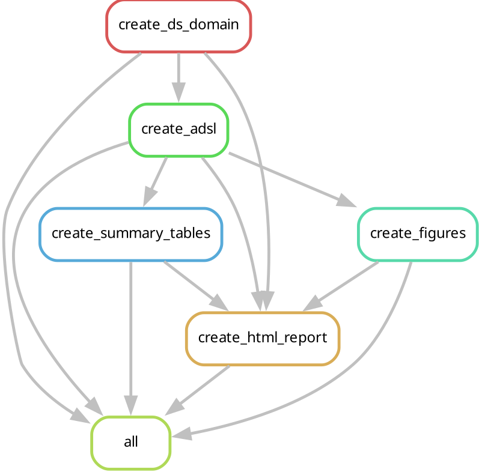

# Roche Analytical Data Science Programmer - Coding Assessment

&nbsp;
## Overview

This repository contains the source code, logs, and outputs for the Roche Coding Assessment. The project focuses on transforming raw clinical data into CDISC-compliant SDTM and ADaM datasets and generating a clinical summary of Treatment-Emergent Adverse Events (TEAEs).

&nbsp;
## Project Structure

```
.
├── question_1_sdtm
│   ├── 01_create_ds_domain.R
│   ├── data
│   │   ├── sdtm_ct.csv
│   │   └── Subject_Disposition_aCRF.pdf
│   ├── log
│   │   ├── 01_create_ds_domain.log
│   │   └── 01_create_ds_domain.msg
│   └── SDTM_DS_FINAL_RESULTS.csv
|
├── question_2_adam
│   ├── 01_create_adsl.R
│   ├── ADSL_FINAL_RESULTS.csv
│   └── log
│       ├── 01_create_adsl.log
│       └── 01_create_adsl.msg
|
├── question_3_tlg
│   ├── 01_create_ae_summary_table.R
│   ├── 02_create_visualizations.R
│   ├── ae_figure_dotplot_top_most_frequent_adverse_events.png
│   ├── ae_severity_distribution_by_treatment.png
│   ├── ae_table_treatment_emergent.html
│   └── log
│       ├── 01_create_ae_summary_table.log
│       ├── 01_create_ae_summary_table.msg
│       ├── 02_create_visualizations.log
│       └── 02_create_visualizations.msg
|
├── question_4_bonus
|
├── question_5_personal_bonus_reproducible_workflow
│   ├── config.yml
│   ├── dag.pdf
│   ├── dag.png
│   ├── envs
│   │   └── r.yaml
│   ├── logs
│   │   ├── 01_create_ds_domain.log
│   │   └── log
│   │       ├── 01_create_ds_domain.log
│   │       └── 01_create_ds_domain.msg
│   ├── modules
│   │   ├── create_adsl.R
│   │   ├── create_ds_domain.R
│   │   ├── create_figures.R
│   │   ├── create_html_report.R
│   │   └── create_summary_tables.R
│   ├── profile_local
│   │   └── config.yaml
│   ├── rules
│   │   └── process.smk
│   └── Snakefile
└── README.md
```
&nbsp;
## Key Technical Implementations
#### 1. SDTM Mapping ({sdtm.oak})

Using the {sdtm.oak} package, we created the SDTM DS domain dataset. This includes:
- Loading the ct, dm and ds_raw datasets from the {pharmaverseraw} package.
- Using assign_ct(), asssign_no_ct(), asign_datetime(), etc, for controlled mapping of variables
- Adding condition_add() if needed to mapping specific rows
- Getting the VISIT information from INSTANCE and create a lookup table for VISITNUM (used derive_vars_merged)

    Comments:
    - would need to create an independant csv file for VISITNUM so we can update it wihtout having to update the code
    - terminnology from DECOD were not present in the CT (Final Lab Visit, Final Retrieval Visit) - I would need to change these as OTHERS but keep DSTERM as it is for its traceability.


#### 2. ADaM Derivations ({admiral})

Using mainly the {admiral} package, we created the ADaM datasets:
- use derive_vars_cat() using lookup table to derive variables (AGEGR9)
- derive_vars_dtm() to get variable from other domains to create adsl dataset
- create event from specific domain dataset to use in conjonction with derive_vars_extreme_event() to create LSTAVLDT

    Comments:
    - needed to ampute the dates for AESTDTC from AE, since some of the dates were incomplete and cause NA generation when using derive_vars_extreme_event()
    - lookup tables for AGEGR9 and AGEGR9N and ITTFL can be genereted as indepedent csv files

#### 3. Clinical Reporting ({gtsummary} & {ggplot2})

TEAE Table: Generated an FDA-standard summary table sorted using gtsummary. Sort by frequencies AETERM and AESOC. Implementation of the function generate_ae_severity_table().

Visualization: Developed reusable {ggplot2} functions generates figures:
- **generate_ae_severity_barchart()** : generate AE Severity barchart for AE Severity distribution by treatment.
- **count_ae_freq()** : count AEs by treatment and AETERM and provide 95% CIs using the Exact Clopper-Pearson method for proportions.
-  **generate_ae_frequency_dotplot()** : generate AE Dot Plot for the Top 10 AEs, sorted by frequency.

    Comments:
    - when running with terminal/Rscript cmd, the only way to generate the html file is to use the sink() function to redirect the output to a file - gtsave() does not work with my envs/terminal

#### 4. Python projects - GenAI Clinical Data Assistant (LLM & LangChain)
TBD/TODO

#### 5. Personal Bonus - Reproducible Workflow

This is a preliminary Snakemake-based workflow to generate the SDTM, ADSL, AE tables and figures in an automated fashion. This workflow is running using your conda environments (with sdmt.oak, gtsummary, etc, path has to be put in the question_5_personal_bonus_reproducible_workflow/rules/process.smk file in each conda section). When running, the workflow will create every output files generated by the scripts used in the previous question.

NB: the create_html_report is not yet implemented because of the need to install every pharmaverse packages into a clean conda env.

- To run the workflow
```{bash}
# Ensure you have Snakemake version 7.32.4 installed
cd question_5_personal_bonus_reproducible_workflow
snakemake --profile profile_local/ -c1 -np # for a dry run
snakemake --profile profile_local/ -c1
```

**DAG of the worflow**

<!---->



&nbsp;
## How to Run

    Ensure you have R version 4.1+ installed.

    Install required libraries:
    R

    install.packages(c("tidyverse", "admiral", "sdtm.oak", "gtsummary" "logr")) + dependencies.

    Clone this repository:
    Bash

    git clone https://github.com/hoang31/roche_coding_assessment.git

    Run the scripts in order (01 through 03). Check the logs/ folder to verify execution success.
    

&nbsp;
## Exemple of execution
```{r}
conda activate your_roche_r_env
Rscript question_1_sdtm/01_create_ds_domain.R # this will create the SDTM_DS_FINAL_RESULTS.csv
```

&nbsp;
## Compliance

All code follows Pharmaverse best practices, focusing on traceability, modularity, and adherence to CDISC SDTM IG 3.4 and ADaM IG 1.3 standards.

## Improvements - if more time is available
